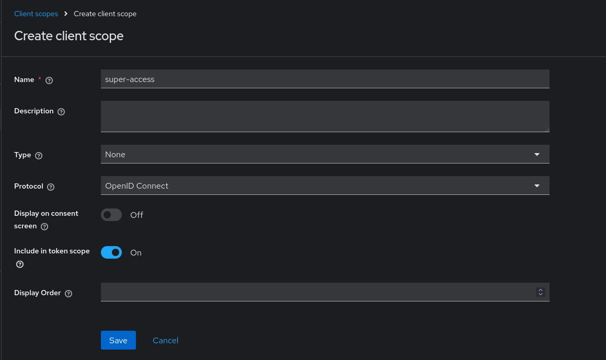
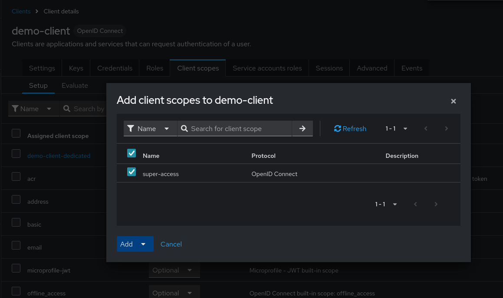
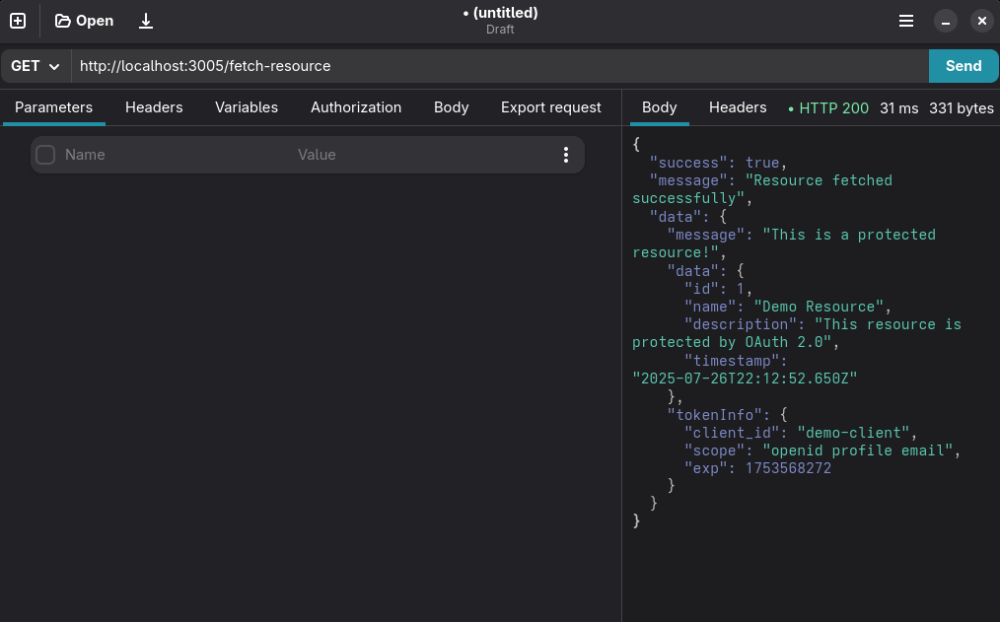

# Resource Server and Client example

> See setup for running instructions

The example showcases the [Client Credentials OAuth2.0 Flow](https://auth0.com/docs/get-started/authentication-and-authorization-flow/client-credentials-flow). Using this flow, the client can gain access tokens that reference itself ( not users ). The client can exchange these tokens with resource servers to gain access to protected resources. Resource servers validate the tokens by introspecting them using the Authorization Server.

## How It Works

**Client Application**: An application that is requesting protected resources from Resource Servers. The client is registered on the Authorization Server ( keycloak in our case ) with the "Service Account Roles" feature enabled. The application itself can be a server ( as shown in the example ) that acts as a middleman for access to the protected resource.

**Resource Server**: An application server that is protecting sensitive resources from clients. The servers is registered as a client on the Authorization Server.

1. Client Application requests an access token from Keycloak using Client Credentials Flow.
2. Client Application uses the token to make requests to the Resource Server.
3. Resource Server validates the token by calling Keycloak's introspection endpoint.
4. If valid, Resource Server returns the protected resource.
5. Client Application automatically handles token refresh when tokens expire.

> Note: Tokens can only be revoked by the issuer client itself ( this means that the Resource Server cannot revoke a client's access tokens ). If this feature is absolutely needed, you may call admin routes to revoke tokens or even disable a client entirely. Another solution is to use the same keycloak client for both the resource server and client.

> Note: The Resource Server can also distingish between clients by parsing the scope parameter. If you create a client scope and add it to a specific client you are then able to parse it in the access token.  

## Setup ( local )

1. Startup a development keycloak instance. You may use the [keycloak-compose](https://github.com/stzagkarak/keycloak-compose) repo.

2. Create the following configuration:

- Create a new realm called `demo-realm`

- Create 2 clients:

1. Client 1: demo-client (for client application)

```
Client ID:              demo-client
Client authentication:  ON
Authorization:          OFF
Standard flow:          OFF
Direct access grants:   OFF
Service accounts roles: ON  ( Required for client credentials flow )
```

Generate client secret and copy to client's .env file

2. Client 2: resource-server (for token introspection and revocation)

```
Client ID:              resource-server
Client authentication:  ON
Authorization:          OFF
All flows:              OFF (this is just for introspection and revocation)
```

Generate client secret and copy to resource server's .env file

3. Run `npm run dev` on both folders.

4. Use a request cli program like `curl` or API toolchain like `postman` to call client's endpoints. 

### Setup ( prod )

1. Create docker containers and a compose file to run both applications inside a server.
2. Recommended to put both applications behind a SSL protected reverse proxy.

#### Issues In production

1. May need to set express trust proxy if the server is running behind a reverse proxy. [Documentation](https://expressjs.com/en/guide/behind-proxies.html) `app.set('trust proxy', 1);`.
2. Setup `cors` depending on your domain restrictions.
3. Don't forget to edit `.env` files with the changed values.
